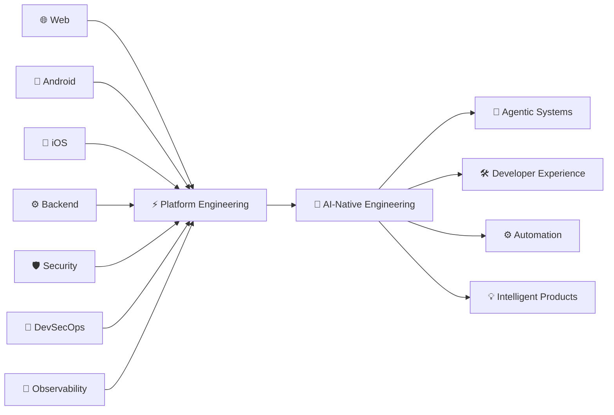

<div align="center">


<br/>

[](https://git.io/typing-svg)

<br/>

[](https://linkedin.com)
[](mailto:hello@emmanuelkorir.dev)
[](https://emmanuelkorir.dev)


</div>

---

## `>_ whoami`

I'm a **Senior Frontend & Mobile Engineer** building secure, scalable and high-performance digital platforms across Web, Android and iOS.

Most of my engineering career has been spent in **FinTech and Digital Banking** — building software where usability, security, reliability and performance aren't optional.

```
Frontend Engineering  ×  Mobile Engineering  ×  Platform Architecture
        ×  Application Security  ×  DevSecOps  ×  AI Engineering
```

> I build interfaces like a frontend engineer, think about systems like a platform engineer, and ship software with security and production reliability in mind.

---

## ⚡ Engineering Snapshot

```typescript
const emmanuel = {
  role:       "Senior Frontend & Mobile Engineer",
  location:   "Nairobi, Kenya 🇰🇪",
  experience: "7+ years",
  domains:    ["FinTech", "Digital Banking", "Enterprise Platforms", "Platform Engineering", "AI & Agentic Systems"],

  web:     { core: ["React", "Next.js", "TypeScript"], state: ["Redux Toolkit", "Zustand"], ui: ["Tailwind CSS", "Shadcn UI"] },
  android: ["Kotlin", "Jetpack Compose", "Coroutines", "Flow", "Hilt", "Ktor", "CameraX", "ML Kit"],
  ios:     ["Swift", "SwiftUI", "LocalAuthentication", "Keychain", "App Attest", "DeviceCheck"],
  cross:   ["React Native", "Capacitor"],
  backend: ["Node.js", "NestJS", "FastAPI", "Ktor", "REST", "SOAP"],
  security:["Certificate Pinning", "Biometrics", "Android Keystore", "iOS Keychain", "Play Integrity", "App Attest", "OWASP"],
  ai:      ["LLM Applications", "AI Agents", "MCP", "Local AI", "Ollama", "Workflow Automation"],

  philosophy: "Build secure systems. Keep the UX simple. Automate everything else."
};
```

---

## 🧠 What I Do

<table>
<tr>
<td width="50%" valign="top">

### 🌐 Web Engineering
Building large-scale web applications and reusable frontend platforms.

`React` `Next.js` `TypeScript` `Design Systems`
`State Architecture` `Micro-frontends` `Accessibility`
`Performance Engineering` `E2E Testing` `Observability`

</td>
<td width="50%" valign="top">

### 📱 Mobile Engineering
Building production-grade Android and iOS applications.

`Kotlin` `Jetpack Compose` `Swift` `SwiftUI`
`React Native` `Capacitor` `CameraX` `ML Kit`
`Push Notifications` `Native Integrations`

</td>
</tr>
<tr>
<td width="50%" valign="top">

### 🛡️ Application Security
Security is part of the architecture — not a final release checkbox.

`SSL / Certificate Pinning` `Payload Encryption`
`Android Keystore` `iOS Keychain` `Biometrics`
`Play Integrity` `App Attest` `Runtime Protection`
`SAST / DAST / SCA` `Shift-Left Security`

</td>
<td width="50%" valign="top">

### ⚙️ Platform & DevSecOps
Engineering the systems around the application.

`Jenkins CI/CD` `GitHub Workflows` `Docker`
`Automated Testing` `Security Gates` `SonarQube`
`MobSF` `GuardSquare` `OpenTelemetry` `Release Automation`

</td>
</tr>
<tr>
<td width="50%" valign="top">

### 🔌 Backend & Integration
Moving beyond the client when architecture requires it.

`Node.js` `NestJS` `FastAPI` `Ktor`
`REST APIs` `SOAP Services` `Authentication`
`API Gateways` `Integration Architecture`

</td>
<td width="50%" valign="top">

### 🤖 AI Engineering
Exploring intelligent systems and AI-native software engineering.

`LLM Applications` `AI Agents` `MCP` `Local Models`
`Ollama` `RAG` `Workflow Automation`
`Developer Agents` `Multi-Agent Systems`

</td>
</tr>
</table>

---

## 🛠️ Technology Arsenal

<div align="center">

**🌐 Web & Frontend**


**📱 Android & iOS**


**⚙️ Backend & APIs**


**🚀 Platform & DevOps**


</div>

---

## 🚀 Selected Engineering Work

<table>
<tr>
<td width="50%" valign="top">

### 🏦 Digital Banking Platform
Engineering secure banking experiences across Web, Android and iOS.

**Capabilities:** Onboarding · KYC · OTP · Statements · Transfers · Payments · Loans · Card Services

**Engineering Focus**
- Secure authentication & native integrations
- Reusable frontend architecture
- High-volume transaction UX
- Performance, reliability & CI/CD
- Application security

**Stack**


</td>
<td width="50%" valign="top">

### 💳 SACCO Digital Ecosystem
Multi-tenant digital banking platform supporting multiple financial institutions from a shared engineering foundation.

**Engineering Focus**
- Multi-tenant architecture & theming
- Shared component library
- Android + Web delivery
- Secure device identity & SSL pinning
- Runtime protection & automated security scanning

**Stack**


</td>
</tr>
<tr>
<td width="50%" valign="top">

### 🧾 Merchant Payments Platform
Native Android merchant banking and payment experiences supporting digital tills and merchant transactions.

**Engineering Focus**
- Native Android architecture
- QR payment journeys & ML Kit integrations
- Secure transaction UX & device security
- Merchant workflows & settlement experiences

**Stack**


</td>
<td width="50%" valign="top">

### 🪪 Digital Onboarding
End-to-end digital customer onboarding covering identity, KYC and account-opening journeys.

**Engineering Focus**
- Multi-step onboarding architecture
- Identification, KYC & document capture
- Account funding & mobile banking enrollment
- Secure API integration

**Stack**


</td>
</tr>
</table>

---

## 🛡️ Secure by Design

```
                         USER
                          │
                          ▼
              ┌───────────────────────┐
              │    USER EXPERIENCE    │
              └───────────┬───────────┘
                          │
                          ▼
              ┌───────────────────────┐
              │   APPLICATION LAYER   │
              │  Web │ Android │ iOS  │
              └───────────┬───────────┘
                          │
                          ▼
        ┌────────────────────────────────────┐
        │         SECURITY CONTROLS          │
        │                                    │
        │  TLS Pinning      Device Integrity │
        │  Biometrics       Secure Storage   │
        │  Encryption       App Hardening    │
        │  AuthN / AuthZ    Runtime Security │
        └──────────────────┬─────────────────┘
                           │
                           ▼
              ┌───────────────────────┐
              │    APIs & SERVICES    │
              └───────────┬───────────┘
                          │
                          ▼
        ┌────────────────────────────────────┐
        │          CI/CD + DEVSECOPS         │
        │   SAST │ SCA │ DAST │ Tests │ Gates│
        └────────────────────────────────────┘
```

> For financial applications, security isn't something I bolt on before production. It starts with the architecture.

---

## 🔐 Security Engineering Pipeline

```
Commit
  │
  ├── ✅ Unit Tests
  ├── 🔍 Linting
  ├── 🛡️  SAST
  ├── 📦 Dependency Scanning
  ├── 📱 Mobile Security Scanning (MobSF)
  ├── 🚦 Quality Gates (SonarQube)
  └── 🏗️  Build
        │
        ▼
      Deploy
        │
        ▼
     Observe (OpenTelemetry)
```

---

## 📡 Observability & Reliability

```
Application
    │
    ├── Logs ──────────────┐
    ├── Metrics ───────────┤
    ├── Traces ────────────┼──▶  OpenTelemetry  ──▶  Observability Platform
    ├── Errors ────────────┤
    └── User Experience ───┘
```

**Areas of focus:** Distributed tracing · Application metrics · Frontend telemetry · Mobile telemetry · Error monitoring · Performance monitoring · Real-user monitoring

---

## 🤖 AI-Native Engineering

```
                         HUMAN
                           │
                           ▼
                ┌─────────────────────┐
                │   AI COMMAND LAYER  │
                └──────────┬──────────┘
                           │
           ┌───────────────┼───────────────┐
           ▼               ▼               ▼
      Coding Agent    Security Agent   Research Agent
           │               │               │
           └───────────────┬───────────────┘
                           │
                           ▼
                    MCP / TOOLS
                           │
          ┌────────────────┼─────────────────┐
          ▼                ▼                 ▼
        GitHub          CI/CD             APIs
          │                │                 │
          └────────────────┼─────────────────┘
                           │
                           ▼
                  LOCAL + CLOUD LLMs
```

**Currently exploring:**

`Agentic AI` `Model Context Protocol` `Local LLMs` `AI Developer Platforms` `RAG` `Workflow Automation` `Multi-Agent Systems` `AI-assisted SDLC` `Developer Agents` `Autonomous Engineering Workflows`

> The interesting question isn't simply *"How can AI write code?"*
>
> It's: **"How do we engineer software organizations where humans and specialized AI agents work together effectively?"**

---

## 🧪 Local AI Lab

```
┌─────────────────────────────────────────────┐
│                 AI WORKSPACE                │
├─────────────────────────────────────────────┤
│                                             │
│  Ollama                                     │
│     ├── Local LLMs                          │
│     └── Embedding Models                    │
│                                             │
│  MCP                                        │
│     ├── Developer Tools                     │
│     ├── APIs                                │
│     └── External Systems                    │
│                                             │
│  Agent Runtime                              │
│     ├── Research                            │
│     ├── Coding                              │
│     ├── Security                            │
│     └── Automation                          │
│                                             │
└─────────────────────────────────────────────┘
```

> Keeping AI systems useful, composable and tool-driven — rather than treating the LLM as the entire architecture.

---

## 🧬 Engineering DNA

```
╭──────────────────────────────────────────────╮
│                                              │
│   BUILD     → Secure                         │
│   DESIGN    → Simple                         │
│   TEST      → Continuously                   │
│   DEPLOY    → Automatically                  │
│   OBSERVE   → Everything                     │
│   SCALE     → Intentionally                  │
│   AUTOMATE  → Repetition                     │
│   LEARN     → Constantly                     │
│                                              │
╰──────────────────────────────────────────────╯
```

---

## 🧭 Engineering Principles

| # | Principle |
|---|-----------|
| 01 | Security starts at the first commit. |
| 02 | Architecture should reduce complexity — not advertise it. |
| 03 | Automate repetitive engineering work. |
| 04 | Observability belongs in the product. |
| 05 | Performance is a feature. |
| 06 | Mobile deserves first-class engineering. |
| 07 | Tests should give teams confidence to ship. |
| 08 | Good abstractions make the next feature cheaper. |
| 09 | Developer experience affects product quality. |
| 10 | Ship → Measure → Learn → Improve. |

---

## 📊 GitHub Analytics

<div align="center">


<br/>


</div>

---

## 🐍 Contribution Stream

<div align="center">

<picture>
  <source media="(prefers-color-scheme: dark)" srcset="https://raw.githubusercontent.com/emmanuelkorir/emmanuelkorir/output/github-contribution-grid-snake-dark.svg" />
  <source media="(prefers-color-scheme: light)" srcset="https://raw.githubusercontent.com/emmanuelkorir/emmanuelkorir/output/github-contribution-grid-snake.svg" />
  
</picture>

</div>

> **Setup:** Add a GitHub Action to generate the snake SVG into the `output` branch. See [Platane/snk](https://github.com/Platane/snk).

---

## 🔭 Where I'm Heading



> My engineering trajectory is increasingly moving toward the intersection of **Application Engineering × Platform Architecture × Security × AI** — while remaining hands-on with the thing that started it all: building great software.

---

## 🎯 Current Focus

```yaml
engineering:
  web:        [Next.js, React, TypeScript]
  mobile:     [Kotlin, Jetpack Compose, Swift, SwiftUI]
  architecture: [Platform Engineering, Multi-Tenant Systems, Design Systems, Secure Application Architecture]
  security:   [DevSecOps, Mobile Application Security, Runtime Protection, Device Integrity]
  reliability: [OpenTelemetry, Observability, Automated Testing]
  ai:         [Agentic Systems, MCP, Local LLMs, AI Automation, Developer Agents]
```

---

## 💡 Things I Enjoy Building

<div align="center">

| 🏦 FinTech | 📱 Mobile | 🌐 Web | 🛡️ Security |
|---|---|---|---|
| Digital Banking | Android · iOS | Next.js · React | DevSecOps |
| Payments | Kotlin · Swift | TypeScript | App Security |
| Onboarding | Jetpack Compose | Design Systems | Hardening |
| Merchant Systems | SwiftUI | Micro-frontends | Secure Architecture |

| 🤖 AI | ⚙️ Platform | 📡 Reliability | 🧑🏾‍💻 DX |
|---|---|---|---|
| AI Agents | CI/CD | Observability | Tooling |
| MCP | Automation | Telemetry | Standards |
| Local LLMs | Containers | Monitoring | Architecture |
| RAG | Security Gates | Diagnostics | Automation |

</div>

---

<div align="center">

### 🤝 Let's Build

[](https://linkedin.com)
[](mailto:hello@emmanuelkorir.dev)
[](https://emmanuelkorir.dev)

<br/>

*I'm particularly interested in engineering problems involving FinTech · Mobile · Platform Engineering · Application Security · AI-Native Systems*

<br/>

**Build secure. Ship confidently. Scale intelligently.**

`< Ideas → Architecture → Code → Impact />`

<sub>Building secure digital experiences, scalable platforms and intelligent engineering systems.</sub>

<br/>


</div>
